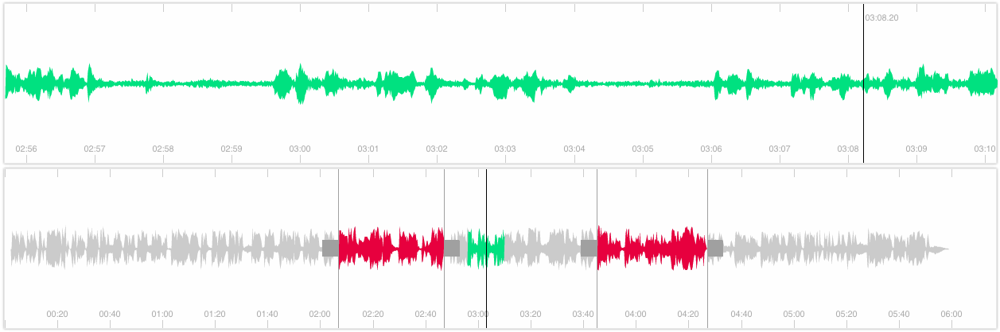

[](https://github.com/bbc/waveform-data.js/actions) [](https://www.npmjs.com/package/waveform-data)

# waveform-data.js

**waveform-data.js** is a JavaScript library for creating zoomable
representations of audio waveforms to enable visualisation of audio content.

**waveform-data.js** is part of a [BBC R&D Browser-based audio waveform visualisation software family](https://waveform.prototyping.bbc.co.uk):

- [audiowaveform](https://github.com/bbc/audiowaveform): C++ program that generates waveform data files from MP3 or WAV format audio.
- [audio_waveform-ruby](https://github.com/bbc/audio_waveform-ruby): A Ruby gem that can read and write waveform data files.
- **waveform-data.js**: JavaScript library that provides access to precomputed waveform data files, or can generate waveform data using the Web Audio API.
- [peaks.js](https://github.com/bbc/peaks.js): JavaScript UI component for interacting with waveforms.

We use these projects within the BBC in applications such as the
[BBC World Service Radio Archive](https://www.bbc.co.uk/rd/projects/worldservice-archive-proto) and browser-based editing and sharing tools for BBC content editors.



# Install

Use `npm` to install `waveform-data.js`, for both Node.js and browser-based
applications:

```bash
npm install --save waveform-data
```

# Usage and examples

waveform-data.js is available as a [UMD](https://github.com/umdjs/umd)
module so it can be used from a `<script>` tag, or as a RequireJS or CommonJS
module. See dist/waveform-data.js and dist/waveform-data.min.js.

## Importing waveform-data.js

### Using a script tag

Simply add **waveform-data.js** in a `script` tag in your HTML page:

```html
<!DOCTYPE html>
<html>
  <body>
    <script src="/path/to/waveform-data.js"></script>
    <script>
      var waveform = new WaveformData(...);
    </script>
  </body>
</html>
```

### Using ES6

An ES6 module build is provided for use with bundlers such as Webpack and Rollup. See dist/waveform-data.esm.js.

```javascript
import WaveformData from 'waveform-data';
```

### Using RequireJS

The UMD bundle can be used with RequireJS:

```javascript
define(['WaveformData'], function(WaveformData) {
  // ...
});
```

### Using CommonJS (Node.js)

A CommonJS build is provided for use with Node.js. See dist/waveform-data.cjs.js.

```javascript
const WaveformData = require('waveform-data');
```

## Receive binary waveform data

You can create and initialise a `WaveformData` object from
waveform data in either binary or JSON format, using the
[Fetch API](https://developer.mozilla.org/en-US/docs/Web/API/Fetch_API/Using_Fetch), as follows.

### Binary format

Use [audiowaveform](https://github.com/bbc/audiowaveform) to generate binary
format waveform data, using a command such as:

```shell
audiowaveform -i track.mp3 -o track.dat -b 8 -z 256
```

Copy the waveform data file `track.dat` to your web server, then use the
following code in your web application to request the waveform data:

```javascript
fetch('https://example.com/waveforms/track.dat')
  .then(response => response.arrayBuffer())
  .then(buffer => WaveformData.create(buffer))
  .then(waveform => {
    console.log(`Waveform has ${waveform.channels} channels`);
    console.log(`Waveform has length ${waveform.length} points`);
  });
```

### JSON format

Alternatively, [audiowaveform](https://github.com/bbc/audiowaveform) can
generate waveform data in JSON format:

```shell
audiowaveform -i track.mp3 -o track.json -b 8 -z 256
```

Use the following code to request the waveform data:

```javascript
fetch('https://example.com/waveforms/track.json')
  .then(response => response.json())
  .then(json => WaveformData.create(json))
  .then(waveform => {
    console.log(`Waveform has ${waveform.channels} channels`);
    console.log(`Waveform has length ${waveform.length} points`);
  });
```

## Using the Web Audio API

You can also create waveform data from audio in the browser, using the
[Web Audio API](https://developer.mozilla.org/en-US/docs/Web/API/Web_Audio_API).

As input, you can either use an `ArrayBuffer` containing the original encoded
audio (e.g., in MP3, Ogg Vorbis, or WAV format), or an `AudioBuffer` containing
the decoded audio samples.

Note that this approach is generally less efficient than pre-processing the
audio server-side, using [audiowaveform](https://github.com/bbc/audiowaveform).

Waveform data is created in two steps:

* If you pass an `ArrayBuffer` containing encoded audio, the audio is decoded
  using the Web Audio API's [decodeAudioData](https://developer.mozilla.org/en-US/docs/Web/API/BaseAudioContext/decodeAudioData)
  method. This must done on the browser's UI thread, so will be a blocking operation.

* The decoded audio is processed to produce the waveform data. To avoid further
  blocking the browser's UI thread, by default this step is done using a
  [Web Worker](https://developer.mozilla.org/en-US/docs/Web/API/Web_Workers_API/Using_web_workers),
  if supported by the browser. You can disable the worker and run the processing
  in the main thread by setting `disable_worker` to `true` in the options.

```javascript
const audioContext = new AudioContext();

fetch('https://example.com/audio/track.ogg')
  .then(response => response.arrayBuffer())
  .then(buffer => {
    const options = {
      audio_context: audioContext,
      array_buffer: buffer,
      scale: 128
    };

    return new Promise((resolve, reject) => {
      WaveformData.createFromAudio(options, (err, waveform) => {
        if (err) {
          reject(err);
        }
        else {
          resolve(waveform);
        }
      });
    });
  })
  .then(waveform => {
    console.log(`Waveform has ${waveform.channels} channels`);
    console.log(`Waveform has length ${waveform.length} points`);
  });
```

If you have an `AudioBuffer` containing decoded audio samples, e.g., from
[AudioContext.decodeAudioData](https://developer.mozilla.org/en-US/docs/Web/API/BaseAudioContext/decodeAudioData)
then you can pass this directly to `WaveformData.createFromAudio`:

```javascript
const audioContext = new AudioContext();

audioContext.decodeAudioData(arrayBuffer)
  .then((audioBuffer) => {
    const options = {
      audio_context: audioContext,
      audio_buffer: audioBuffer,
      scale: 128
    };

    return new Promise((resolve, reject) => {
      WaveformData.createFromAudio(options, (err, waveform) => {
        if (err) {
          reject(err);
        }
        else {
          resolve(waveform);
        }
      });
    });
  })
  .then(waveform => {
    console.log(`Waveform has ${waveform.channels} channels`);
    console.log(`Waveform has length ${waveform.length} points`);
  });
```

## Drawing a waveform image

Once you've created a `WaveformData` object, you can use it to draw a waveform
image, using the
[Canvas API](https://developer.mozilla.org/en-US/docs/Web/API/Canvas_API) or
a visualization library such as [D3.js](https://d3js.org/).

### Canvas example

```javascript
const waveform = WaveformData.create(raw_data);

const scaleY = (amplitude, height) => {
  const range = 256;
  const offset = 128;

  return height - ((amplitude + offset) * height) / range;
}

const ctx = canvas.getContext('2d');
ctx.beginPath();

const channel = waveform.channel(0);

// Loop forwards, drawing the upper half of the waveform
for (let x = 0; x < waveform.length; x++) {
  const val = channel.max_sample(x);

  ctx.lineTo(x + 0.5, scaleY(val, canvas.height) + 0.5);
}

// Loop backwards, drawing the lower half of the waveform
for (let x = waveform.length - 1; x >= 0; x--) {
  const val = channel.min_sample(x);

  ctx.lineTo(x + 0.5, scaleY(val, canvas.height) + 0.5);
}

ctx.closePath();
ctx.stroke();
ctx.fill();
```

## D3.js example

See [demo/d3.html](demo/d3.html).

### HTML

```html
<div id="waveform-container"></div>
```

### JavaScript

```javascript
const waveform = WaveformData.create(raw_data);
const channel = waveform.channel(0);
const container = d3.select('#waveform-container');
const x = d3.scaleLinear();
const y = d3.scaleLinear();
const offsetX = 100;

const min = channel.min_array();
const max = channel.max_array();

x.domain([0, waveform.length]).rangeRound([0, 1000]);
y.domain([d3.min(min), d3.max(max)]).rangeRound([offsetX, -offsetX]);

const area = d3.svg.area()
  .x((d, i) => x(i))
  .y0((d, i) => y(min[i]))
  .y1((d, i) => y(d));

const graph = container.append('svg')
  .style('width', '1000px')
  .style('height', '200px')
  .datum(max)
  .append('path')
  .attr('transform', () => `translate(0, ${offsetX})`)
  .attr('d', area)
  .attr('stroke', 'black');

```

## In Node.js

You can use waveform-data.js to consume or generate waveform data from a Node.js
application, e.g., a web server.

```javascript
const WaveformData = require('waveform-data');
const express = require('express');
const fs = require('fs');
const app = express();

app.get('/waveforms/:id.json', (req, res) => {
  res.set('Content-Type', 'application/json');

  fs.createReadStream(`path/to/${req.params.id}.json`)
    .pipe(res);
});
```

The following example shows a Node.js command-line application that requests
waveform data from a web API and resamples it to a width of 2000 pixels.

```javascript
#!/usr/bin/env node

// Save as: app/bin/cli-resampler.js

const WaveformData = require('waveform-data');
const request = require('superagent');
const args = require('yargs').argv;

request.get(`https://api.example.com/waveforms/${args.waveformid}.json`)
  .then(response => {
    const waveform = WaveformData.create(response.body);
    const resampledWaveform = waveform.resample({ width: 2000 });
    const channel = resampledWaveform.channel(0);

    process.stdout.write(JSON.stringify({
      min: channel.min_array(),
      max: channel.max_array()
    }));
});
```

Usage: `./app/bin/cli-resampler.js --waveformid=1337`

# Data format

The file format used and consumed by `WaveformData` is documented [here](https://github.com/bbc/audiowaveform/blob/master/doc/DataFormat.md) as part of the [**audiowaveform** project](https://waveform.prototyping.bbc.co.uk).

# JavaScript API

Please refer [here](doc/API.md) for full API documentation.

# Browser support

Any browser supporting **ECMAScript 5** will be enough to use the library -
think [`Array.forEach`](http://kangax.github.io/es5-compat-table/#Array.prototype.forEach):

 * IE9+, Firefox Stable, Chrome Stable, Safari 6+ are fully supported;
 * IE10+ is required for the [TypedArray](http://caniuse.com/#feat=typedarrays) Adapter;
 * Firefox 23+ and Webkit/Blink browsers are required for [Web Audio API](http://caniuse.com/#feat=audio-api) support.

# Development

To develop the code, install [Node.js](http://nodejs.org/) and
[npm](https://npmjs.org/). After obtaining the waveform-data.js source code,
run `npm install` to install Node.js package dependencies.

# Credits

This library was written by:

* [Thomas Parisot](https://github.com/oncletom)
* [Chris Needham](https://github.com/chrisn)

Thank you to all our
[contributors](https://github.com/bbc/waveform-data.js/graphs/contributors).

This program contains code adapted from
[Audacity](http://audacity.sourceforge.net/), used with permission.

# License

See [LICENSE](https://github.com/bbc/waveform-data.js/blob/master/LICENSE)
for details.

# Contributing

Every contribution is welcomed, either it's code, idea or a *merci*!

[Guidelines are provided](CONTRIBUTING.md) and every commit is tested against
unit tests using [Karma runner](http://karma-runner.github.io) and the
[Chai assertion library](http://chaijs.com/).

# Copyright

Copyright 2025 British Broadcasting Corporation
